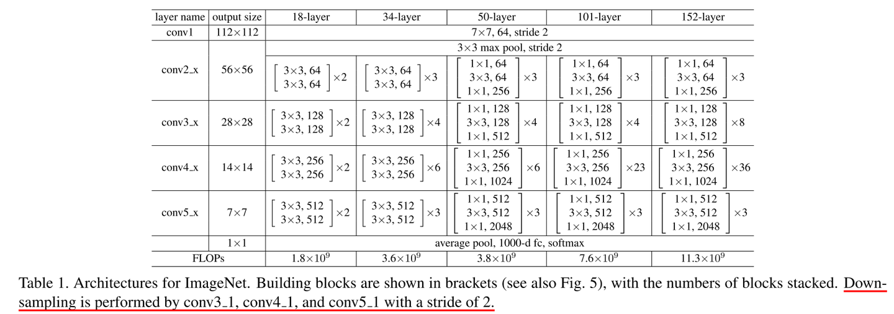

# resnet

ResNet-50 是一种深度卷积神经网络，广泛用于各种计算机视觉任务。其架构主要由以下部分组成：

初始层（Stem）
    Conv1: 7x7 卷积，步幅为 2，输出通道数为 64。
    BatchNorm1
    ReLU
    MaxPool: 3x3 最大池化，步幅为 2。

残差块（Residual Blocks）
    Layer1: 包含 3 个 Bottleneck 模块，输出通道数为 256。
    Layer2: 包含 4 个 Bottleneck 模块，输出通道数为 512。
    Layer3: 包含 6 个 Bottleneck 模块，输出通道数为 1024。
    Layer4: 包含 3 个 Bottleneck 模块，输出通道数为 2048。
    

# R-50-C4
使用 ResNet-50 的 C4 层（通常对应于 layer4）的输出作为检测头的输入

# R-50-DC5
修改 ResNet-50 的 C5 层，采用膨胀卷积（Dilated Convolution）以增加感受野，同时保持特征图的空间分辨率。

# R-50-FPN
FPN为NECK，将resnet的输出，进行融合，FPN 通过自顶向下路径和横向连接，将不同层级的特征图（C2, C3, C4, C5）融合，生成多尺度的特征金字塔（P2, P3, P4, P5）。